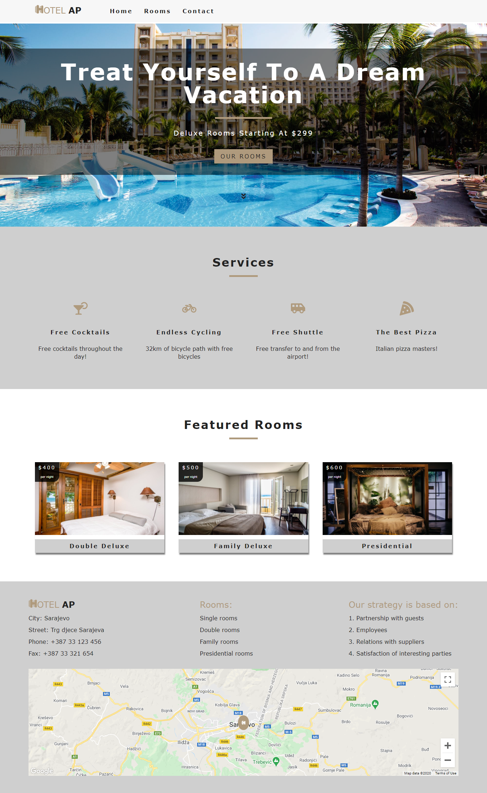
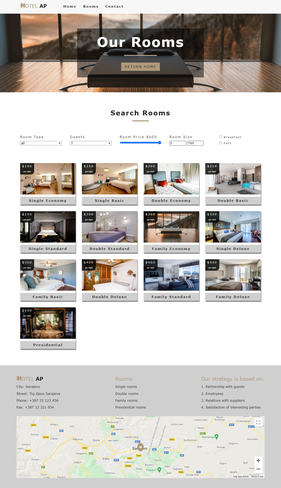
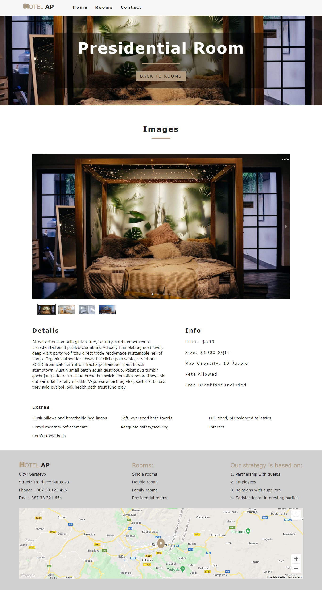

HotelAP
=================

HotelAP app illustrating Web development best practices using React.js.
[Live Demo](https://eldarcelik.github.io/hotel-ap/)

Introduction
------------

The app have functionalities of displaying and filtering hotel rooms by type, price, capacity, etc. and a detail view for each individual room.

### Technical Requirements
* React.js
    * React Router - Using client-side routing to create a single page application
    * React Context - Working with global state (save, update and consume state)
* Content Delivery API
    * I created and stored data on Contentful. It is a read-only API for delivering content from Contentful to websites.
* Responsive app 
    * Propper HTML structure and CSS layout skills (no CSS frameworks)